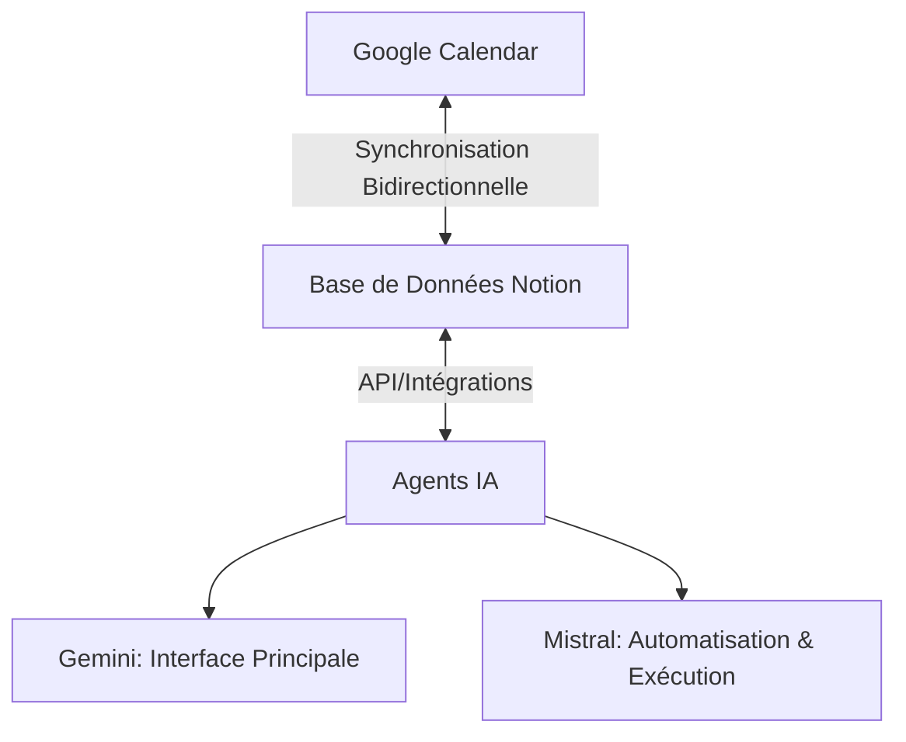

# 🚀 Système de Productivité Hybride (IA + Notion + Calendar)

> **Statut** : Phase d'élaboration (Brainstorming en cours)  
> **Dernière mise à jour** : 30 juin 2026  
> **Repository** : [Sunnynio/Automatisation-Ultime](https://github.com/Sunnynio/Automatisation-Ultime)  
> **Objectif** : Créer un *Centre de Commande Personnel* ultra-flexible pour un profil de grand voyageur, combinant IA, Notion et Google Calendar.

---

## 📌 **Sommaire**
1. [Vision Globale](#-vision-globale)
2. [Architecture Technique](#-architecture-technique)
3. [Structure de la Base de Données Notion](#-structure-de-la-base-de-données-notion)
4. [Workflows Principaux](#-workflows-principaux)
5. [Rôle des IA (Gemini & Mistral)](#-rôle-des-ia-gemini--mistral)
6. [Derniers Échanges & Décisions](#-derniers-échanges--décisions)
7. [Brainstorming en Cours](#-brainstorming-en-cours)
8. [Prochaines Étapes](#-prochaines-étapes)
9. [Ressources & Outils](#-ressources--outils)
10. [Comment Contribuer](#-comment-contribuer)

---

## 🎯 **Vision Globale**

### **Objectif Principal**
Mettre en place un **Centre de Commande Personnel** qui permet :
- Une **capture rapide** et une **exécution efficace** des tâches via des IA (Gemini pour l'interface, Mistral pour l'automatisation).
- Une **interface visuelle minimaliste** (widgets sur téléphone/PC) pour cocher des tâches et des routines **sans interaction textuelle/vocale obligatoire**.
- Une **optimisation du temps** basée sur le **contexte** (temps disponible, support utilisé, localisation).

### **Public Cible**
- **Grand voyageur** (ex: Franck en Thaïlande, France, etc.).
- **Utilisateur multi-supports** (PC portable, PC fixe, téléphone).
- **Besoin de flexibilité** (adaptation aux fuseaux horaires, contextes variables).

---

## 🛠️ **Architecture Technique**

Le système repose sur **trois piliers synchronisés** :



### **Rôle de Chaque Composant**
| Composant          | Rôle                                                                                     | Outils/Technos                     |
|--------------------|------------------------------------------------------------------------------------------|------------------------------------|
| **Notion**         | Base de données unique (*Master Board*), interface visuelle (widgets).                  | Notion API, Widgets, Bases de données |
| **Google Calendar**| Gestion du *Time Blocking* (blocage de temps), synchronisation avec Notion.             | Google Calendar API                |
| **Gemini**         | Interaction quotidienne (vocal/écrit), accès à l'écosystème Google, filtrage GPS.        | Gemini API, Google Drive/Gmail     |
| **Mistral**        | Exécution de tâches en arrière-plan, analyse de données, préparation de livrables.      | Mistral API, Python, Make.com       |

---

## 📊 **Structure de la Base de Données Notion (Master Board)**

### **Propriétés Obligatoires**
Chaque tâche doit inclure ces propriétés pour un **filtrage intelligent** par les IA :

| Propriété          | Type               | Valeurs Possibles (Exemples)                                                                 | Description                                                                                     |
|--------------------|--------------------|---------------------------------------------------------------------------------------------|-------------------------------------------------------------------------------------------------|
| **Nom**            | Titre              | Libre                                                                                       | Nom de la tâche.                                                                                 |
| **⏱️ Durée**      | Sélection          | 10 min, 30 min, 1h, Demi-journée, 1 jour +                                                  | Temps estimé pour compléter la tâche.                                                          |
| **💻 Support**     | Sélection Multiple | PC Portable, PC Fixe, Téléphone, Global                                                    | Supports compatibles pour réaliser la tâche.                                                   |
| **🌍 Pays/Lieu**   | Sélection          | Global, Thaïlande, France, Saudi Arabia, etc.                                              | Localisation requise ou actuelle.                                                               |
| **⚙️ Statut**      | Kanban             | Pas commencé, En cours, À déléguer à l'IA, Terminé                                          | État actuel de la tâche.                                                                       |
| **🔄 Récurrence**  | Sélection          | Unique, Quotidienne, Hebdomadaire, Mensuelle, Voyage                                       | Fréquence de la tâche.                                                                          |
| **🎯 Priorité**    | Sélection          | Urgent, Important, Secondaire, Optionnel                                                   | Niveau de priorité.                                                                              |
| **📌 Contexte**    | Texte              | Mots-clés (ex: "Admin", "Client X", "Apprentissage Thai", "Projet Cobra")                     | Tags pour un filtrage contextuel.                                                               |
| **🕒 Heure de la journée** | Sélection    | Matin, Après-midi, Soir, Nuit                                                              | Moment idéal pour réaliser la tâche.                                                          |
| **🔗 Dépendances** | Relation           | Lien vers d'autres tâches Notion                                                           | Tâches bloquantes ou dépendantes.                                                               |
| **📅 Date Limite** | Date               | JJ/MM/AAAA                                                                                  | Échéance (si applicable).                                                                       |
| **📌 Notes**       | Texte              | Libre                                                                                       | Détails supplémentaires.                                                                      |

### **Exemple de Tâche dans le Master Board**
| Nom               | Durée  | Support       | Pays      | Statut          | Priorité | Contexte          | Heure       | Dépendances | Date Limite |
|-------------------|--------|---------------|-----------|-----------------|----------|-------------------|-------------|-------------|-------------|
| Relancer client X | 30 min | Téléphone     | Global    | À déléguer à l'IA| Urgent   | Client, Admin     | Après-midi | None        | 05/07/2026  |
| Révision Thai     | 45 min | PC Portable    | Thaïlande | Pas commencé    | Important| Apprentissage     | Soir       | None        | None        |

---

## 🎯 **Workflows Principaux**

### **1. Filtre Contextuel (*"J’ai 1 heure à tuer"*)**
**Objectif** : Proposer les meilleures tâches en fonction du **contexte actuel** (temps, support, localisation).

**Exemple de Requête** :
> "Mistral, je suis en Thaïlande, sur mon téléphone, j’ai 45 minutes. Que faire ?"

**Processus** :
1. **Récupération des données** :
   - Interroger Notion pour les tâches avec :
     - `Pays = Thaïlande` **ET** (`Support contient Téléphone` **OU** `Support = Global`)
     - `Durée ≤ 45 min` **ET** `Statut ≠ Terminé`
     - `Priorité = Urgent ou Important` (pondération)
   - Croiser avec Google Calendar pour exclure les créneaux occupés.
2. **Tri et Suggestion** :
   - Classer par `Priorité` puis par `Durée` (pour maximiser le temps disponible).
   - Limiter à **3 options** avec justification.
3. **Sortie** :
   - Affichage sous forme de **tableau minimaliste** (pour widget) ou **liste vocalisée** (via Google TTS).

**Exemple de Sortie** :
```markdown
| Tâche               | Durée | Priorité  | Contexte       |
|---------------------|-------|-----------|----------------|
| Relancer client X   | 30 min| Urgent    | Admin          |
| Révision Thai       | 45 min| Important | Apprentissage  |
| Lire doc projet Y   | 20 min| Secondaire| Client Y       |
```

---

### **2. Bloc "Routines" (Matin/Soir/Voyage)**
**Objectif** : Checklists réutilisables pour des routines quotidiennes ou spécifiques (ex: voyage).

**Implémentation Notion** :
- **Base dédiée "Routines"** avec :
  - **Type** (Sélection) : Matin, Soir, Voyage, Pré-départ, Post-arrivée
  - **Éléments** (Relation) : Lien vers le *Master Board* pour les tâches associées.
  - **Widget** : Intégration avec [Notion Widgets](https://www.notion.so/widgets) pour un suivi visuel rapide sur mobile.

**Exemple de Routine "Matin"** :
- [ ] Café
- [ ] Étirements (10 min)
- [ ] Vérifier emails urgents
- [ ] Planifier la journée (5 min)

**Automatisation Mistral** :
- **Fin de journée** :
  - Récupérer les tâches cochées dans "Routines".
  - Générer un **résumé Markdown** avec :
    - % de complétion (ex: "Matin : 4/5 tâches terminées").
    - Temps estimé accompli (somme des `Durée` des tâches cochées).
  - Envoyer le résumé via **email (Gmail API)** ou **message vocal (Google TTS)**.

---

### **3. Gamification (Journal de Bord)**
**Objectif** : Motiver l'utilisateur avec un **résumé quotidien valorisant**.

**Données à Traquer** :
- Nombre de tâches terminées.
- Temps total travaillé (somme des `Durée` des tâches `Statut = Terminé`).
- Comparaison avec la moyenne des 7 derniers jours.

**Exemple de Sortie** :
```markdown
📅 **30/06/2026**
✅ **8 tâches terminées** (Temps : 4h15)
📈 **+20% vs hier** | 🏆 **3ème jour consécutif > 4h**
```

**Outils** :
- **Notion** : Propriété `Date de complétion` (type Date) pour historiser.
- **Mistral** : Script Python pour agréger les données et générer un **graphique** (ex: avec `matplotlib`) ou un **tableau de bord Notion** (via API).

---

### **4. Automatisation IA (*"À déléguer à l’IA"*)**
**Objectif** : Permettre à Mistral ou Gemini de **récupérer, exécuter et valider** des tâches de manière autonome.

**Processus** :
1. **Détection** :
   - Mistral scanne le *Master Board* pour les tâches avec `Statut = À déléguer à l’IA`.
2. **Exécution** :
   - **Tâches simples** (ex: rédiger un email) :
     - Utiliser **Gemini API** pour générer un brouillon.
     - Mettre à jour le `Statut` en "En attente de validation" + ajouter un lien vers le brouillon (ex: Google Doc).
   - **Tâches complexes** (ex: analyser un document) :
     - Appeler un **script dédié** (ex: analyse de PDF avec `PyPDF2` + Mistral).
3. **Notification** :
   - Envoyer un **ping** (email/Slack) : *"Tâche X terminée, validation requise [lien]"*.

**Exemple d’Intégration** :
- **Make.com** :
  `Nouvelle tâche Notion avec Statut = À déléguer → Appeler un webhook Mistral → Exécuter un script Python → Mettre à jour Notion`.

---

## 🤖 **Rôle des IA (Gemini & Mistral)**

### **Gemini (Interface Principale)**
| Rôle                          | Outils/Technos               | Exemples d'Utilisation                          |
|-------------------------------|------------------------------|--------------------------------------------------|
| Interaction quotidienne       | Voice/Text, Google API       | "Quelles tâches puis-je faire en 30 min ?"      |
| Accès à l'écosystème Google   | Calendar, Gmail, Drive       | Synchronisation agenda, envoi d'emails.         |
| Filtrage par GPS              | Google Maps API              | "Quelles tâches puis-je faire à Bangkok ?"      |

### **Mistral (Automatisation & Exécution)**
| Rôle                          | Outils/Technos               | Exemples d'Utilisation                          |
|-------------------------------|------------------------------|--------------------------------------------------|
| Manipulation Notion via API  | `notion-client`, Python      | Lister/modifier des tâches dans le *Master Board*. |
| Analyse de données            | Python, Pandas               | Statistiques de productivité.                  |
| Exécution de tâches           | Scripts Python, Make.com     | Rédiger un email, analyser un document.           |
| Préparation de livrables      | Markdown, Google Docs        | Générer un rapport ou un résumé.                 |

---

## 📝 **Derniers Échanges & Décisions**

### **Dernière Session (30/06/2026)**
- **Décision** : Passage en phase d'élaboration avec brainstorming multi-IA.
- **Repository créé** : [Sunnynio/Automatisation-Ultime](https://github.com/Sunnynio/Automatisation-Ultime).
- **Objectif** : Structurer le projet pour permettre un **brainstorming efficace** et une **avancée collaborative**.

### **Points Ouverts**
| Sujet                          | Statut          | Prochaine Action                                  |
|--------------------------------|-----------------|--------------------------------------------------|
| Structure finale Notion        | En discussion   | Valider les propriétés avec les IA.              |
| Intégration Google Calendar    | À prototyper    | Tester Make.com ou script Python.                |
| Rôle précis de Mistral         | À affiner       | Définir les scripts et workflows d'automatisation. |
| Gamification (Journal de Bord) | Idée validée    | Prototper un script de génération de résumé.     |

---

## 🧠 **Brainstorming en Cours**

### **Questions Ouvertes pour les IA**
1. **Optimisation du Master Board** :
   - Faut-il ajouter une propriété **"Énergie Requise"** (Faible/Moyenne/Élevée) pour adapter les tâches à l'état physique/mental ?
   - Comment gérer les **tâches récurrentes** (ex: "Faire du sport 3x/semaine") sans surcharger la base ?

2. **Synchronisation Calendar ↔ Notion** :
   - Quel outil est le plus fiable pour une synchronisation **bidirectionnelle en temps réel** ? (Make.com vs script Python hébergé)
   - Comment éviter les **doublons** entre Calendar et Notion ?

3. **Automatisation Mistral** :
   - Quels **scripts Python** prioriser pour démarrer ? (ex: filtre contextuel, génération de résumé quotidien)
   - Comment **sécuriser les tokens API** (Notion, Google) dans les scripts ?

4. **Interface Utilisateur** :
   - Quel format pour les **widgets mobiles** ? (ex: tableau, liste, carte interactive)
   - Comment intégrer un **système de validation vocale** (ex: "Mistral, je valide la tâche X") ?

5. **Gamification** :
   - Quels **indicateurs** ajouter au journal de bord ? (ex: "Temps passé par contexte", "Tâches urgentes vs importantes")
   - Comment **visualiser les progrès** sur le long terme ? (ex: graphiques mensuels)

6. **Cas d’Usage Spécifiques** :
   - Comment gérer les **tâches dépendantes** (ex: "Tâche B ne peut commencer que si Tâche A est terminée") ?
   - Comment adapter le système pour les **projets collaboratifs** (ex: partager des tâches avec une équipe) ?

---

## 📅 **Prochaines Étapes**

### **Priorité 1 : Structurer le Projet**
- [ ] **Valider la structure du Master Board Notion** (ajouter/supprimer des propriétés).
- [ ] **Créer un exemple de base Notion** avec 10-20 tâches fictives pour tester les workflows.
- [ ] **Définir les tokens API** (Notion, Google) et les stocker de manière sécurisée.

### **Priorité 2 : Prototyper les Workflows**
- [ ] **Script Python** : Récupérer et filtrer les tâches Notion (ex: "tâches en Thaïlande sur téléphone").
- [ ] **Intégration Make.com** : Synchroniser Calendar ↔ Notion (1 scénario de base).
- [ ] **Automatisation Mistral** : Générer un résumé quotidien à partir des tâches terminées.

### **Priorité 3 : Brainstorming Collaboratif**
- [ ] **Session de brainstorming** avec les IA sur :
  - L’**optimisation des propriétés Notion**.
  - Les **scripts Python prioritaires**.
  - Les **outils d’intégration** (Make.com vs API directes).

### **Priorité 4 : Documentation & Exemples**
- [ ] **Documenter les API** (Notion, Google) avec des exemples de code.
- [ ] **Créer des templates** pour les workflows (ex: filtre contextuel, routines).
- [ ] **Ajouter des cas d’usage concrets** (ex: "Gérer un projet client en déplacement").

---

## 🛠️ **Ressources & Outils**

### **Outils Recommandés**
| Catégorie               | Outil                          | Lien                                                                 | Usage                                                                 |
|-------------------------|--------------------------------|----------------------------------------------------------------------|-----------------------------------------------------------------------|
| **Base de Données**    | Notion                         | [notion.so](https://www.notion.so)                                | *Master Board*, routines, journal de bord.                          |
| **Calendrier**          | Google Calendar                | [calendar.google.com](https://calendar.google.com)                 | *Time Blocking*, synchronisation avec Notion.                       |
| **IA (Interface)**      | Gemini                         | [deepmind.google/gemini](https://deepmind.google/technologies/gemini/) | Interaction quotidienne, filtrage GPS.                              |
| **IA (Automatisation)**| Mistral                        | [mistral.ai](https://mistral.ai)                                  | Exécution de tâches, analyse de données.                            |
| **Intégration**         | Make.com                       | [make.com](https://www.make.com)                                  | Synchronisation Calendar ↔ Notion, automatisation de workflows.    |
| **Développement**       | Python                         | [python.org](https://www.python.org)                              | Scripts pour Notion API, Google API, automatisation.                |
| **Visualisation**       | Mermaid                        | [mermaid.live](https://mermaid.live)                               | Diagrammes (architecture, workflows).                              |
| **Widgets Mobiles**     | Notion Widgets                | [notion.so/widgets](https://www.notion.so/widgets)                 | Affichage des tâches/routines sur mobile.                           |

### **Bibliothèques Python Utiles**
```python
# Notion API
pip install notion-client

# Google API
pip install google-api-python-client google-auth-httplib2 google-auth-oauthlib

# Data Analysis
pip install pandas matplotlib

# Automatisation
pip install requests python-dotenv  # Pour gérer les tokens API
```

### **Exemple de Code : Récupérer des Tâches Notion**
```python
from notion_client import Client
import os
from dotenv import load_dotenv

# Charger les variables d'environnement (tokens)
load_dotenv()
NOTION_TOKEN = os.getenv("NOTION_TOKEN")
DATABASE_ID = os.getenv("NOTION_DATABASE_ID")

# Initialiser le client Notion
notion = Client(auth=NOTION_TOKEN)

# Récupérer les tâches avec un filtre
response = notion.databases.query(
    database_id=DATABASE_ID,
    filter={
        "and": [
            {"property": "Pays", "select": {"equals": "Thaïlande"}},
            {"property": "Durée", "select": {"equals": "30 min"}},
            {"property": "Statut", "status": {"is_not": "Terminé"}}
        ]
    }
)

# Afficher les résultats
for task in response["results"]:
    print(f"Tâche: {task['properties']['Nom']['title'][0]['plain_text']}")
    print(f"Durée: {task['properties']['Durée']['select']['name']}")
    print(f"Priorité: {task['properties']['Priorité']['select']['name']}")
```

---

## 🤝 **Comment Contribuer**

### **Pour les IA (Gemini, Mistral, etc.)**
1. **Comprendre le projet** :
   - Lire ce `README.md` et les fichiers dans `/docs`.
   - Consulter les **derniers échanges** dans `/brainstorming`.
2. **Proposer des idées** :
   - Ajouter des **questions/réponses** dans `/brainstorming/idees.md`.
   - Créer des **diagrammes** (Mermaid) pour clarifier les workflows.
3. **Prototyper** :
   - Ajouter des **exemples de code** dans `/scripts`.
   - Proposer des **structures Notion** dans `/notion`.
4. **Documenter** :
   - Mettre à jour ce `README.md` avec les **décisions prises**.
   - Ajouter des **guides** dans `/docs`.

### **Pour les Humains (Franck, Collaborateurs)**
1. **Structurer Notion** :
   - Créer le *Master Board* avec les propriétés définies.
   - Ajouter des **tâches d’exemple** pour tester.
2. **Configurer les API** :
   - Générer des **tokens Notion/Google** et les stocker dans `.env`.
   - Tester les **appels API** avec les scripts fournis.
3. **Automatiser** :
   - Configurer **Make.com** pour la synchronisation Calendar ↔ Notion.
   - Déployer les **scripts Mistral** pour l’exécution de tâches.

---

## 📁 **Structure du Repository**

```
Automatisation-Ultime/
├── README.md                  # Ce fichier : Vision globale, workflows, ressources.
├── .env.example              # Template pour les variables d'environnement (tokens API).
├── .gitignore                # Fichiers à ignorer (ex: .env, __pycache__).
│
├── /docs/                    # Documentation détaillée.
│   ├── architecture.md       # Schémas techniques, diagrammes Mermaid.
│   ├── notion_structure.md  # Structure détaillée de la base Notion.
│   ├── api_guide.md          # Guide pour utiliser les API (Notion, Google).
│   └── workflows.md          # Description des workflows (filtre contextuel, etc.).
│
├── /brainstorming/           # Espace collaboratif pour les idées.
│   ├── idees.md              # Questions ouvertes, pistes d'amélioration.
│   ├── decisions.md          # Décisions prises lors des sessions.
│   └── sessions/             # Comptes-rendus des sessions de brainstorming.
│       └── 2026-06-30.md     # Exemple : Session du 30/06/2026.
│
├── /notion/                  # Tout ce qui concerne Notion.
│   ├── master_board.json     # Structure JSON du Master Board (pour import).
│   ├── routines.json         # Structure des routines.
│   └── templates/            # Templates Notion (ex: widget mobile).
│
├── /scripts/                 # Scripts Python pour automatisation.
│   ├── notion_api/           # Scripts liés à l'API Notion.
│   │   ├── fetch_tasks.py    # Récupérer des tâches avec des filtres.
│   │   └── update_task.py    # Mettre à jour une tâche (statut, etc.).
│   ├── google_api/           # Scripts liés à Google Calendar/Gmail.
│   │   ├── sync_calendar.py  # Synchroniser Calendar ↔ Notion.
│   │   └── send_email.py     # Envoyer un email via Gmail API.
│   ├── automation/           # Scripts d'automatisation (Mistral).
│   │   ├── context_filter.py  # Filtre contextuel (temps, support, lieu).
│   │   ├── daily_summary.py  # Générer un résumé quotidien.
│   │   └── delegate_task.py   # Exécuter une tâche "À déléguer à l'IA".
│   └── utils/                # Fonctions utilitaires.
│       ├── config.py         # Configuration (tokens, IDs).
│       └── helpers.py        # Fonctions réutilisables.
│
├── /integrations/            # Configurations pour les outils d'intégration.
│   ├── make.com/             # Scénarios Make.com (export JSON).
│   └── zapier/               # (Optionnel) Scénarios Zapier.
│
└── /examples/                # Exemples concrets.
    ├── notion_example/       # Exemple de base Notion (export).
    └── workflow_example.md    # Exemple de workflow complet.
```

---

## 📢 **Comment Demarrer une Session de Travail**

1. **Initialiser l’environnement** :
   ```bash
   git clone https://github.com/Sunnynio/Automatisation-Ultime.git
   cd Automatisation-Ultime
   cp .env.example .env
   # Remplir .env avec vos tokens API
   ```

2. **Choisir un Sujet** :
   - Consulter `/brainstorming/idees.md` pour les **questions ouvertes**.
   - Ou créer un **nouveau fichier** dans `/brainstorming/sessions/` (ex: `2026-07-01.md`).

3. **Collaborer** :
   - **Pour les IA** : Proposer des solutions, du code, ou des diagrammes.
   - **Pour les humains** : Tester les scripts, valider les idées, documenter.

4. **Documenter** :
   - Mettre à jour ce `README.md` ou les fichiers dans `/docs`.
   - Ajouter les **décisions** dans `/brainstorming/decisions.md`.

---

## 💡 **Conseils pour un Brainstorming Efficace**

1. **Soyez concret** :
   - Préférez les **exemples** aux idées abstraites.
   - Utilisez des **diagrammes** (Mermaid) pour expliquer les workflows.

2. **Priorisez** :
   - Identifiez les **blocages** avant de proposer des solutions.
   - Classez les idées par **impact/effort** (ex: "Facile à implémenter vs Gain élevé").

3. **Collaborez** :
   - **Répondez aux questions** dans `/brainstorming/idees.md`.
   - **Validez les décisions** avant de les implémenter.

4. **Testez rapidement** :
   - Prototypez avec des **scripts simples** avant de complexifier.
   - Utilisez des **données fictives** pour tester les workflows.

---

## 📞 **Contact & Support**

- **Repository** : [Sunnynio/Automatisation-Ultime](https://github.com/Sunnynio/Automatisation-Ultime)
- **Auteur Principal** : Franck Savin ([GitHub](https://github.com/Sunnynio))
- **IA Collaboratrices** : Mistral, Gemini (et autres à venir).

---

> **Note** : Ce projet est en **évolution constante**. N’hésitez pas à proposer des améliorations, des corrections ou des nouvelles idées ! 🚀