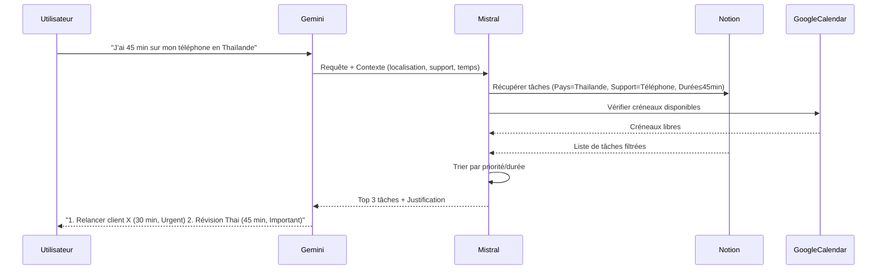
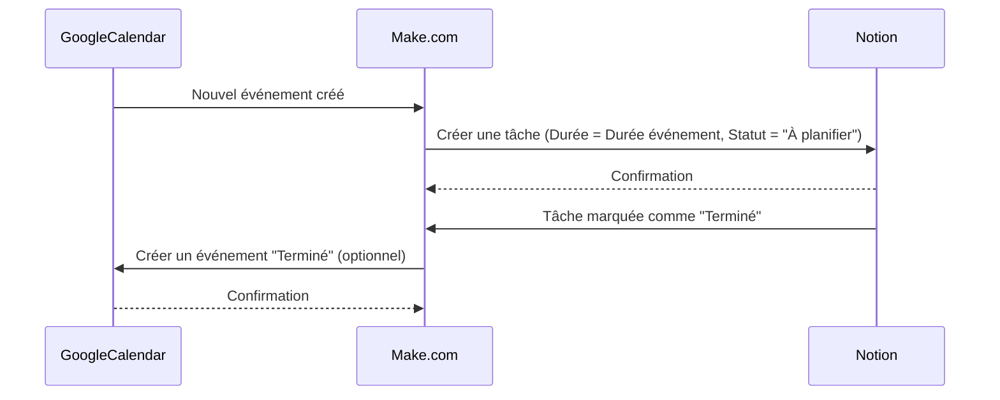
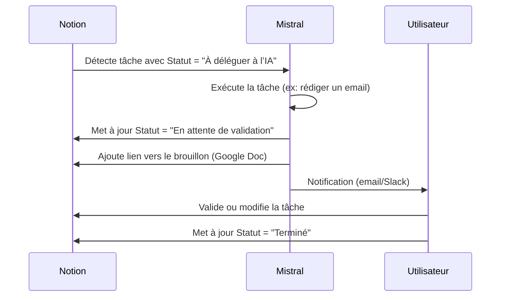
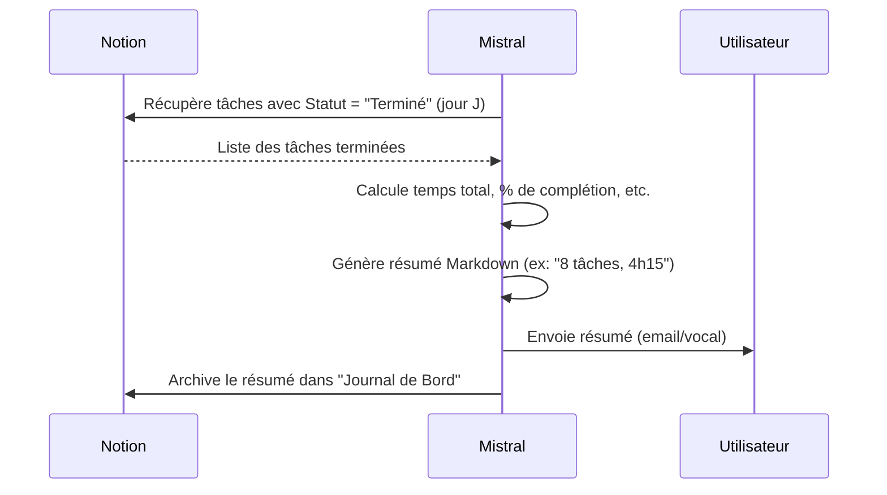
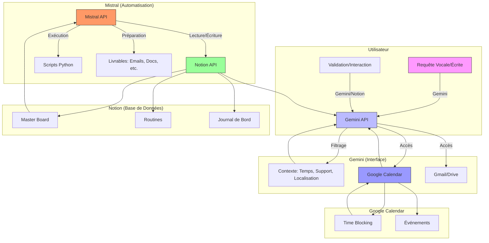
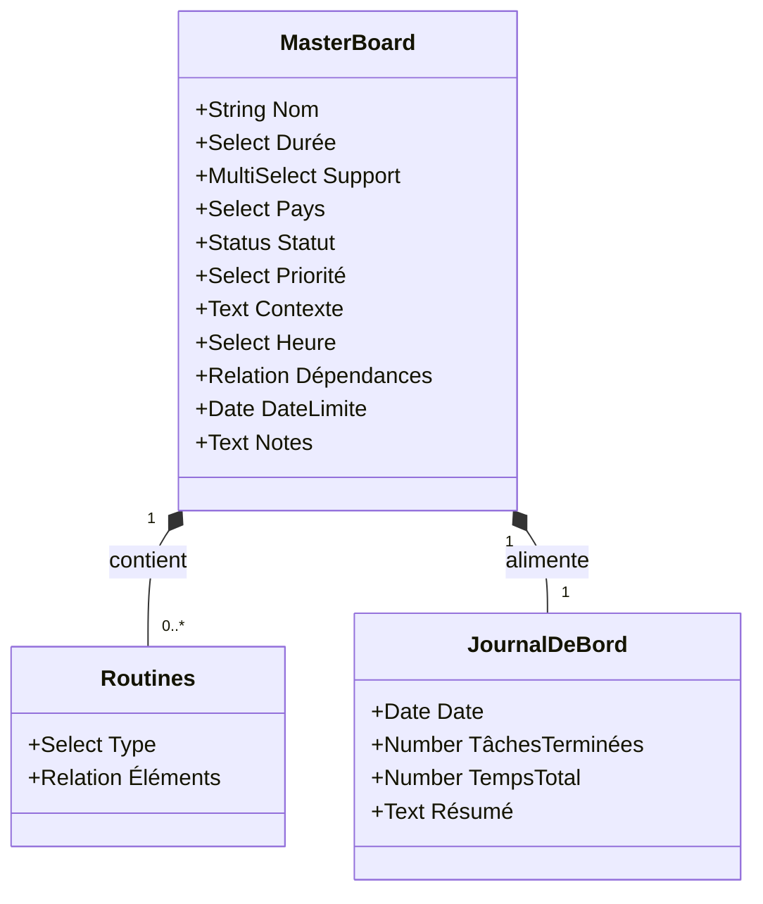

# 🏗️ Architecture Technique du Système de Productivité Hybride

> **Dernière mise à jour** : 30 juin 2026  
> **Statut** : En élaboration (Brainstorming multi-IA en cours)  
> **Repository** : [Sunnynio/Automatisation-Ultime](https://github.com/Sunnynio/Automatisation-Ultime)

---

## 📌 **Sommaire**
1. [Vue d’Ensemble](#-vue-densemble)
2. [Composants Principaux](#-composants-principaux)
3. [Flux de Données](#-flux-de-données)
4. [Diagrammes Techniques](#-diagrammes-techniques)
5. [Détails par Composant](#-détails-par-composant)
6. [Points de Synchronisation](#-points-de-synchronisation)
7. [Sécurité et Bonnes Pratiques](#-sécurité-et-bonnes-pratiques)

---

## 🌐 **Vue d’Ensemble**

Le système repose sur une **architecture modulaire** avec trois piliers synchronisés :
- **Notion** : Base de données centrale et interface visuelle.
- **Google Calendar** : Gestion du temps et des événements.
- **Agents IA** (Gemini, Mistral) : Interaction, filtrage contextuel et automatisation.

**Objectif** : Créer un **Centre de Commande Personnel** qui s’adapte au contexte de l’utilisateur (localisation, support, temps disponible).

---

## 🧩 **Composants Principaux**

### **1. Notion (Cœur du Système)**
| Élément               | Rôle                                                                 | Technos/Outils                          |
|-----------------------|----------------------------------------------------------------------|----------------------------------------|
| **Master Board**      | Base de données unique pour toutes les tâches.                     | Notion Database                        |
| **Routines**          | Checklists réutilisables (matin, soir, voyage).                     | Notion Database + Widgets              |
| **Journal de Bord**   | Historique des tâches terminées et statistiques.                    | Notion Database + Formules             |
| **Widgets Mobiles**   | Affichage minimaliste pour cocher des tâches rapidement.            | Notion Widgets / Apps tierces          |

**Propriétés Clés du Master Board** :
- `Durée`, `Support`, `Pays/Lieu`, `Statut`, `Priorité`, `Contexte`, `Heure de la journée`, `Dépendances`.

---

### **2. Google Calendar (Gestion du Temps)**
| Élément               | Rôle                                                                 | Technos/Outils                          |
|-----------------------|----------------------------------------------------------------------|----------------------------------------|
| **Time Blocking**     | Blocage de créneaux pour les tâches.                                | Google Calendar API                    |
| **Événements**        | Synchronisation avec les tâches Notion.                             | Google Calendar API                    |
| **Rappels**           | Notifications pour les tâches urgentes.                              | Google Calendar + Notifications       |

---

### **3. Agents IA**

#### **Gemini (Interface Principale)**
| Capacité                     | Description                                                                 | Technos/Outils                          |
|------------------------------|-----------------------------------------------------------------------------|----------------------------------------|
| **Interaction Vocale/Écrite** | Comprendre les requêtes naturelles (ex: "J’ai 1h sur mon téléphone").   | Gemini API + Google NLP                |
| **Filtrage GPS**              | Adapter les suggestions en fonction de la localisation.               | Google Maps API + Gemini                |
| **Accès à Google Ecosystem** | Lire/écrire dans Calendar, Gmail, Drive.                                | Google APIs                             |
| **Génération de Contenu**    | Rédiger des emails, résumés, etc.                                       | Gemini API                              |

#### **Mistral (Automatisation & Exécution)**
| Capacité                     | Description                                                                 | Technos/Outils                          |
|------------------------------|-----------------------------------------------------------------------------|----------------------------------------|
| **Manipulation Notion**      | Lire/écrire/modifier des tâches via API.                                 | `notion-client` (Python)                |
| **Analyse de Données**        | Statistiques, tendances, optimisations.                                | Python (Pandas, Matplotlib)            |
| **Exécution de Tâches**      | Préparer des livrables (emails, documents, analyses).                  | Python + APIs tierces                   |
| **Automatisation**           | Déclencher des actions sans intervention humaine.                     | Make.com / Scripts Python               |

---

## 🔄 **Flux de Données**

### **1. Flux Principal (Filtre Contextuel)**


---

### **2. Flux de Synchronisation (Calendar ↔ Notion)**


---

### **3. Flux d’Automatisation (Tâches "À déléguer à l’IA")**


---

### **4. Flux de Gamification (Journal de Bord)**


---

## 📊 **Diagrammes Techniques**

### **1. Architecture Globale**


---

### **2. Structure de la Base Notion**


---

### **3. Workflow du Filtre Contextuel**
```mermaid
flowchart TD
    A[Utilisateur: "J’ai 45 min sur téléphone en Thaïlande"] --> B[Gemini: Analyse la requête]
    B --> C[Extrait: Temps=45min, Support=Téléphone, Pays=Thaïlande]
    C --> D[Mistral: Requête Notion]
    D --> E[Filtre: Pays=Thaïlande AND Support=Téléphone AND Durée≤45min AND Statut≠Terminé]
    E --> F[Trie: Priorité DESC, Durée ASC]
    F --> G[Limite: Top 3 tâches]
    G --> H[Gemini: Formate la réponse]
    H --> I[Utilisateur: Affiche 3 options]
    
    style A fill:#f9f,stroke:#333
    style I fill:#9f9,stroke:#333
```

---

### **4. Synchronisation Calendar ↔ Notion**
```mermaid
flowchart LR
    subgraph GoogleCalendar
        A[Nouvel Événement] --> B[Make.com]
        C[Événement Modifié] --> B
    end
    
    subgraph Make.com
        B -->|Créer Tâche| D[Notion: Master Board]
        B -->|Mettre à jour| D
    end
    
    subgraph Notion
        D -->|Tâche Terminée| E[Make.com]
        E -->|Créer Événement "Terminé"| F[Google Calendar]
    end
    
    style A fill:#99f,stroke:#333
    style D fill:#9f9,stroke:#333
```

---

## 🔍 **Détails par Composant**

### **1. Notion**

#### **Master Board**
- **Type** : Base de données Notion.
- **Propriétés** : Voir [Structure de la Base de Données Notion](../README.md#-structure-de-la-base-de-données-notion).
- **Fonctionnalités** :
  - Filtrage avancé via l’API.
  - Synchronisation avec Google Calendar.
  - Intégration avec les widgets mobiles.

#### **Routines**
- **Type** : Base de données Notion dédiée.
- **Structure** :
  - **Type** (Matin/Soir/Voyage).
  - **Éléments** (Lien vers le Master Board).
- **Affichage** : Widgets interactifs sur mobile/PC.

#### **Journal de Bord**
- **Type** : Base de données Notion + Formules.
- **Données** :
  - Date.
  - Nombre de tâches terminées.
  - Temps total travaillé.
  - Résumé quotidien (généré par Mistral).

---

### **2. Google Calendar**

#### **Time Blocking**
- **Principe** : Bloquer des créneaux dans le calendrier pour des tâches spécifiques.
- **Synchronisation** :
  - **Calendar → Notion** : Créer une tâche Notion pour chaque événement.
  - **Notion → Calendar** : Optionnel (créer un événement pour les tâches terminées).

#### **Intégration avec Notion**
- **Outils** : Make.com ou script Python (via Google Calendar API).
- **Fréquence** : Synchronisation en temps réel ou par lots (ex: toutes les 15 min).

---

### **3. Agents IA**

#### **Gemini**
- **Rôle** : Interface principale pour l’utilisateur.
- **Fonctionnalités** :
  - **Compréhension du langage naturel** : Interpréter les requêtes (ex: "J’ai 1h à tuer").
  - **Filtrage contextuel** : Croiser les données Notion + Calendar + GPS.
  - **Génération de contenu** : Rédiger des emails, résumés, etc.
  - **Accès aux APIs Google** : Calendar, Gmail, Drive, Maps.

- **Technos** :
  - **API** : [Gemini API](https://ai.google.dev/gemini-api/docs).
  - **SDK** : `google-generativeai` (Python).

#### **Mistral**
- **Rôle** : Automatisation et exécution de tâches en arrière-plan.
- **Fonctionnalités** :
  - **Manipulation de Notion** : Lire/écrire/modifier des tâches via l’API.
  - **Analyse de données** : Statistiques, optimisations, tendances.
  - **Exécution de tâches** : Préparer des livrables (emails, documents, analyses).
  - **Automatisation** : Déclencher des actions sans intervention humaine.

- **Technos** :
  - **API** : [Mistral API](https://docs.mistral.ai/).
  - **Bibliothèques** : `notion-client` (Python), `requests`, `pandas`.

---

## 🔗 **Points de Synchronisation**

### **1. Notion ↔ Google Calendar**
| Événement                     | Action Notion                          | Action Calendar                     | Outil Recommandé       |
|------------------------------|----------------------------------------|------------------------------------|------------------------|
| Nouvel événement Calendar    | Créer une tâche (Statut = "À planifier")| -                                  | Make.com / Script Python |
| Tâche Notion marquée "Terminé"| -                                      | Créer un événement "Terminé" (optionnel) | Make.com / Script Python |
| Modification d’un événement | Mettre à jour la tâche correspondante  | -                                  | Make.com               |

---

### **2. Notion ↔ Mistral**
| Événement                     | Action Notion                          | Action Mistral                     | Outil Recommandé       |
|------------------------------|----------------------------------------|------------------------------------|------------------------|
| Tâche avec Statut = "À déléguer à l’IA" | - | Exécuter la tâche, mettre à jour Statut = "En attente de validation" | Script Python + API Notion |
| Tâche validée par l’utilisateur | Mettre à jour Statut = "Terminé" | - | API Notion |

---

### **3. Mistral ↔ Utilisateur**
| Événement                     | Action Mistral                     | Action Utilisateur                     | Canal               |
|------------------------------|------------------------------------|--------------------------------------|----------------------|
| Tâche exécutée               | Envoyer une notification           | Valider ou modifier la tâche        | Email / Slack / Vocal |
| Résumé quotidien généré      | Envoyer le résumé                  | Consulter le journal de bord         | Email / Vocal         |

---

## 🔒 **Sécurité et Bonnes Pratiques**

### **1. Gestion des Tokens API**
- **Ne jamais commiter** : Utiliser `.gitignore` pour exclure `.env`.
- **Permissions minimales** :
  - Notion : Donner uniquement les permissions **nécessaires** (ex: lecture/écriture sur une base spécifique).
  - Google : Limiter les **scopes** (ex: `https://www.googleapis.com/auth/calendar` pour Calendar uniquement).
- **Rotation des tokens** : Changer les tokens tous les **3-6 mois**.

### **2. Stockage des Données**
- **Chiffrement** : Utiliser des outils comme `git-secret` pour chiffrer les fichiers sensibles.
- **Backup** : Sauvegarder régulièrement les bases Notion (export JSON/CSV).

### **3. Logs et Audit**
- **Journaliser les actions** : Conserver un historique des modifications (ex: qui a mis à jour une tâche ?).
- **Alertes** : Configurer des notifications pour les actions sensibles (ex: suppression de tâches).

---

## 📚 **Ressources Complémentaires**
- [Notion API Documentation](https://developers.notion.com/docs)
- [Google Calendar API Documentation](https://developers.google.com/calendar/api)
- [Gemini API Documentation](https://ai.google.dev/gemini-api/docs)
- [Mistral API Documentation](https://docs.mistral.ai/)
- [Make.com Documentation](https://www.make.com/en/help/api)
- [OAuth 2.0 Guide (Google)](https://developers.google.com/identity/protocols/oauth2)

---

> **Prochaine Étape** :
> - [ ] Valider les diagrammes avec les IA collaboratrices.
> - [ ] Affiner les flux de données (ex: ajouter des cas d’erreur).
> - [ ] Proposer des optimisations (ex: cache pour les appels API).